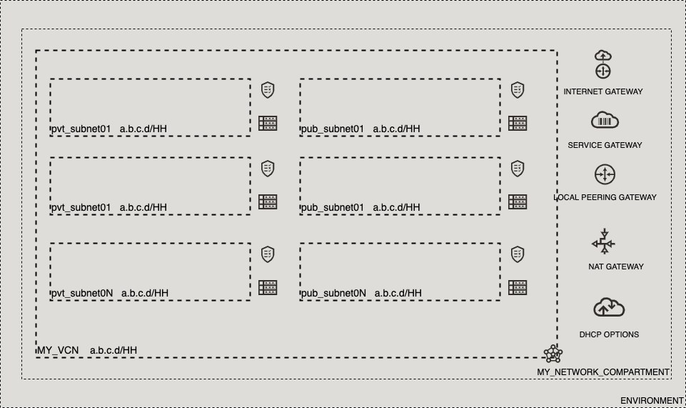

# OCI Cloud Bricks: Network Artifacts

[](https://img.shields.io/badge/license-UPL-green) [](https://sonarcloud.io/dashboard?id=oracle-devrel_terraform-oci-cloudbricks-network-artifacts)

## Introduction
The following cloud brick enables you to create a fully operational network with the following components: 

- A single VCN, with support to add multiple CIDR non overlapping blocks
- Supports N private subnets, adding them into map variable on tfvars file
- Supports N public subnets, adding them into map variable on tfvars file
- Single Security List for Private Subnets
- Single Security List for Public Subnets
- NAT Gateway, associated to private subnet
- Service Gateway, associated two both private a public instances. Public instance will only contain storage services route and private will contain all services on Availability Domain
- Internet Gateway, associated to public subnet
- Local Peering Gateway placeholder

## Reference Architecture
The following is the reference architecture associated to this brick



### Prerequisites
- Pre-existent unique Compartment to holster the network

## Sample tfvar file

If implementation is intended to be a HUB

```shell
########## IS HUB ##########
########## SAMPLE TFVAR FILE ##########
########## PROVIDER SPECIFIC VARIABLES ##########
region           = "foo-region-1"
tenancy_ocid     = "ocid1.tenancy.oc1..abcdefg"
user_ocid        = "ocid1.user.oc1..aaaaaaabcdefg"
fingerprint      = "fo:oo:ba:ar:ba:ar"
private_key_path = "/absolute/path/to/api/key/your_api_key.pem"
########## PROVIDER SPECIFIC VARIABLES ##########

########## ARTIFACT SPECIFIC VARIABLES ##########
vcn_cidr_blocks                     = ["10.0.0.0/16"]
private_subnet_cidr_block_map       = { "pvtsn01" : "10.0.0.0/23", "pvtsn02" : "10.0.2.0/23", "pvtsn03" : "10.0.4.0/23" }
public_subnet_cidr_block_map        = { "pubsn01" : "10.0.6.0/23", "pubsn02" : "10.0.8.0/23", "pubsn03" : "10.0.10.0/23" }
vcn_display_name                    = "VCN_DISPLAY_NAME"
vcn_network_compartment_name        = "MY_NETWORK_COMPARTMENT"
dhcp_options_display_name           = "DHCP_Options"
custom_search_domain                = "test.com"
private_route_table_display_name    = "pvt_rt"
public_route_table_display_name     = "pub_rt"
private_security_list_display_name  = "pvt_sl"
public_security_list_display_name   = "pub_sl"
service_gateway_display_name        = "SVC_GW"
nat_gateway_display_name            = "NAT_GW"
internet_gateway_display_name       = "INET_GW"
lpg_count                           = 1
lpg_display_name_base               = "LPG"
peered_vcn_network_compartment_name = ""
peered_lpg_display_name             = ""
is_spoke                            = false
########## ARTIFACT SPECIFIC VARIABLES ##########
########## SAMPLE TFVAR FILE ##########
########## IS HUB ##########
```

If implementation is intended to be a SPOKE 

```shell
########## IS SPOKE ##########
########## SAMPLE TFVAR FILE ##########
########## PROVIDER SPECIFIC VARIABLES ##########
region           = "foo-region-1"
tenancy_ocid     = "ocid1.tenancy.oc1..abcdefg"
user_ocid        = "ocid1.user.oc1..aaaaaaabcdefg"
fingerprint      = "fo:oo:ba:ar:ba:ar"
private_key_path = "/absolute/path/to/api/key/your_api_key.pem"
########## PROVIDER SPECIFIC VARIABLES ##########

########## ARTIFACT SPECIFIC VARIABLES ##########
vcn_cidr_blocks                     = ["12.0.0.0/16"]
private_subnet_cidr_block_map       = { "pvtsn01" : "12.0.0.0/23", "pvtsn02" : "12.0.2.0/23", "pvtsn03" : "12.0.4.0/23" }
public_subnet_cidr_block_map        = { "pubsn01" : "12.0.6.0/23", "pubsn02" : "12.0.8.0/23", "pubsn03" : "12.0.10.0/23" }
vcn_display_name                    = "VCN_DISPLAY_NAME"
vcn_network_compartment_name        = "MY_NETWORK_COMPARTMENT"
dhcp_options_display_name           = "DHCP_Options"
custom_search_domain                = "test.com"
private_route_table_display_name    = "pvt_hub_rt"
public_route_table_display_name     = "pub_hub_rt"
private_security_list_display_name  = "pvt_hub_sl"
public_security_list_display_name   = "pub_hub_sl"
service_gateway_display_name        = "SVC_GW"
nat_gateway_display_name            = "NAT_GW"
internet_gateway_display_name       = "INET_GW"
lpg_count                           = 1
lpg_display_name_base               = "LPG"
peered_vcn_network_compartment_name = "HUB_VCN_NAME"
peered_lpg_display_name             = "HUB01_LPG02"
is_spoke                            = true
########## ARTIFACT SPECIFIC VARIABLES ##########
########## SAMPLE TFVAR FILE ##########
########## IS SPOKE ##########
```

### Variable specific considerations
- Cloudbricks framework allows a single VCN per each compartment. Breaking this rule, will prevent the code to work correctly
- This code allows to create either a HUB or SPOKE Network. If a hub is in place, then variable `is_spoke` will be set to `true`
- When filling variables `private_subnet_cidr_block_map` and `public_subnet_cidr_block_map` it expected to provide a comma separated tuple containing first the name of the subnet and then it's corresponding CIDR block
- Variable `vcn_network_compartment_name` expect a single unique compartment name. Neglecting this step, will break the framework
- Variable `custom_search_domain` allows to overload the value of a custom DHCP provider
- `lpg_count` variable allows to create Local Peering Gateway placeholders inside the VCN. If provisioning a HUB, then this number needs to be as high as environments are connected to this HUB. For example, if environments are PRD, DEV and QA, then this number needs to be set to `3`. On the other hand, if provisioning a SPOKE, this number always needs to be set to `1`
- Variable `lpg_display_name_base` represents the basic constructor of the LPG Name. This allows internally to create correlative values for LPG. In case of provisioning a HUB, leave this as `HUB_LPG`, in any other case, set this variable to `ENV_LPG` where `ENV` is the name of Environment being provisioned, i.e `PRD_LPG`
- If provisioning a SPOKE, variable `peered_vcn_network_compartment_name` needs to reference the display name of the HUB VCN and `peered_lpg_display_name` needs to correspond to one unique of the LPG created on HUB. If provisioning a spoke, these variables needs to be blank as `""`
- If provisioning a HUB, variable `is_spoke` needs to be `false`. If a SPOKE is in place this variable needs to be set to `true`

---
## Sample provider
The following is the base provider definition to be used with this module

```shell
terraform {
  required_version = ">= 0.13.5"
}
provider "oci" {
  region       = var.region
  tenancy_ocid = var.tenancy_ocid
  user_ocid        = var.user_ocid
  fingerprint      = var.fingerprint
  private_key_path = var.private_key_path
  disable_auto_retries = "true"
}

provider "oci" {
  alias        = "home"
  region       = data.oci_identity_region_subscriptions.home_region_subscriptions.region_subscriptions[0].region_name
  tenancy_ocid = var.tenancy_ocid  
  user_ocid        = var.user_ocid
  fingerprint      = var.fingerprint
  private_key_path = var.private_key_path
  disable_auto_retries = "true"
}
```
---
## Variable documentation
## Requirements

| Name | Version |
|------|---------|
| <a name="requirement_terraform"></a> [terraform](#requirement\_terraform) | >= 0.13.5 |

## Providers

| Name | Version |
|------|---------|
| <a name="provider_oci"></a> [oci](#provider\_oci) | 4.36.0 |
| <a name="provider_oci.home"></a> [oci.home](#provider\_oci.home) | 4.36.0 |
| <a name="provider_random"></a> [random](#provider\_random) | 3.1.0 |

## Modules

No modules.

## Resources

| Name | Type |
|------|------|
| [oci_core_dhcp_options.DHCPOptions](https://registry.terraform.io/providers/hashicorp/oci/latest/docs/resources/core_dhcp_options) | resource |
| [oci_core_internet_gateway.INETGateway](https://registry.terraform.io/providers/hashicorp/oci/latest/docs/resources/core_internet_gateway) | resource |
| [oci_core_local_peering_gateway.LocalPeeringGateway](https://registry.terraform.io/providers/hashicorp/oci/latest/docs/resources/core_local_peering_gateway) | resource |
| [oci_core_nat_gateway.NATGateway](https://registry.terraform.io/providers/hashicorp/oci/latest/docs/resources/core_nat_gateway) | resource |
| [oci_core_route_table.PrivateRouteTable](https://registry.terraform.io/providers/hashicorp/oci/latest/docs/resources/core_route_table) | resource |
| [oci_core_route_table.PublicRouteTable](https://registry.terraform.io/providers/hashicorp/oci/latest/docs/resources/core_route_table) | resource |
| [oci_core_security_list.PrivateSecurityList](https://registry.terraform.io/providers/hashicorp/oci/latest/docs/resources/core_security_list) | resource |
| [oci_core_security_list.PublicSecurityList](https://registry.terraform.io/providers/hashicorp/oci/latest/docs/resources/core_security_list) | resource |
| [oci_core_service_gateway.PrivateServiceGateway](https://registry.terraform.io/providers/hashicorp/oci/latest/docs/resources/core_service_gateway) | resource |
| [oci_core_subnet.PrivateSubnet](https://registry.terraform.io/providers/hashicorp/oci/latest/docs/resources/core_subnet) | resource |
| [oci_core_subnet.PublicSubnet](https://registry.terraform.io/providers/hashicorp/oci/latest/docs/resources/core_subnet) | resource |
| [oci_core_vcn.VCN](https://registry.terraform.io/providers/hashicorp/oci/latest/docs/resources/core_vcn) | resource |
| [oci_identity_tag.release](https://registry.terraform.io/providers/hashicorp/oci/latest/docs/resources/identity_tag) | resource |
| [oci_identity_tag_namespace.devrel](https://registry.terraform.io/providers/hashicorp/oci/latest/docs/resources/identity_tag_namespace) | resource |
| [random_id.tag](https://registry.terraform.io/providers/hashicorp/random/latest/docs/resources/id) | resource |
| [oci_core_local_peering_gateways.PEERLPG](https://registry.terraform.io/providers/hashicorp/oci/latest/docs/data-sources/core_local_peering_gateways) | data source |
| [oci_core_services.ALLSERVICES](https://registry.terraform.io/providers/hashicorp/oci/latest/docs/data-sources/core_services) | data source |
| [oci_core_services.STORAGESERVICES](https://registry.terraform.io/providers/hashicorp/oci/latest/docs/data-sources/core_services) | data source |
| [oci_core_vcns.PEEREDVCN](https://registry.terraform.io/providers/hashicorp/oci/latest/docs/data-sources/core_vcns) | data source |
| [oci_identity_compartments.NWCOMPARTMENTS](https://registry.terraform.io/providers/hashicorp/oci/latest/docs/data-sources/identity_compartments) | data source |
| [oci_identity_compartments.PEEREDNWCOMPARTMENTS](https://registry.terraform.io/providers/hashicorp/oci/latest/docs/data-sources/identity_compartments) | data source |
| [oci_identity_region_subscriptions.home_region_subscriptions](https://registry.terraform.io/providers/hashicorp/oci/latest/docs/data-sources/identity_region_subscriptions) | data source |

## Inputs

| Name | Description | Type | Default | Required |
|------|-------------|------|---------|:--------:|
| <a name="input_custom_search_domain"></a> [custom\_search\_domain](#input\_custom\_search\_domain) | A domain name where the custom option can be applied | `any` | n/a | yes |
| <a name="input_dhcp_options_display_name"></a> [dhcp\_options\_display\_name](#input\_dhcp\_options\_display\_name) | (Optional) (Updatable) A user-friendly name. Does not have to be unique, and it's changeable. Avoid entering confidential information. | `any` | n/a | yes |
| <a name="input_fingerprint"></a> [fingerprint](#input\_fingerprint) | API Key Fingerprint for user\_ocid derived from public API Key imported in OCI User config | `any` | n/a | yes |
| <a name="input_internet_gateway_display_name"></a> [internet\_gateway\_display\_name](#input\_internet\_gateway\_display\_name) | (Optional) (Updatable) A user-friendly name. Does not have to be unique, and it's changeable. Avoid entering confidential information. | `any` | n/a | yes |
| <a name="input_internet_gateway_enabled"></a> [internet\_gateway\_enabled](#input\_internet\_gateway\_enabled) | Describes if the Internet Gateway is enabled upon creation or not | `bool` | `true` | no |
| <a name="input_is_private_subnet_private"></a> [is\_private\_subnet\_private](#input\_is\_private\_subnet\_private) | Describes if the subnet is private or not | `bool` | `true` | no |
| <a name="input_is_public_subnet_private"></a> [is\_public\_subnet\_private](#input\_is\_public\_subnet\_private) | Describes if the subnet is private or not | `bool` | `false` | no |
| <a name="input_is_spoke"></a> [is\_spoke](#input\_is\_spoke) | Boolean that describes if the compartment is a spoke or not | `bool` | `true` | no |
| <a name="input_label_zs"></a> [label\_zs](#input\_label\_zs) | Auxiliary variable to concatenate with lpg number | `list(any)` | <pre>[<br>  "0",<br>  ""<br>]</pre> | no |
| <a name="input_lpg_count"></a> [lpg\_count](#input\_lpg\_count) | Number of LPG to create | `number` | `1` | no |
| <a name="input_lpg_display_name_base"></a> [lpg\_display\_name\_base](#input\_lpg\_display\_name\_base) | Local Peering Gateway Display Name Base | `any` | n/a | yes |
| <a name="input_nat_gateway_display_name"></a> [nat\_gateway\_display\_name](#input\_nat\_gateway\_display\_name) | NAT Gateway Display Name | `any` | n/a | yes |
| <a name="input_peered_lpg_display_name"></a> [peered\_lpg\_display\_name](#input\_peered\_lpg\_display\_name) | Display name of peered LPG | `string` | `""` | no |
| <a name="input_peered_vcn_display_name"></a> [peered\_vcn\_display\_name](#input\_peered\_vcn\_display\_name) | Name of the peered VCN where the peered LPG is created | `string` | `""` | no |
| <a name="input_peered_vcn_network_compartment_name"></a> [peered\_vcn\_network\_compartment\_name](#input\_peered\_vcn\_network\_compartment\_name) | Name of the compartment where the VCN that's going to be peered is | `string` | `""` | no |
| <a name="input_private_key_path"></a> [private\_key\_path](#input\_private\_key\_path) | Private Key Absolute path location where terraform is executed | `any` | n/a | yes |
| <a name="input_private_route_table_display_name"></a> [private\_route\_table\_display\_name](#input\_private\_route\_table\_display\_name) | Private Route Table Display Name. | `any` | n/a | yes |
| <a name="input_private_route_table_nat_route_rules_description"></a> [private\_route\_table\_nat\_route\_rules\_description](#input\_private\_route\_table\_nat\_route\_rules\_description) | (Optional) (Updatable) An optional description of your choice for the rule. | `string` | `"NAT Gateway default route"` | no |
| <a name="input_private_route_table_nat_route_rules_destination"></a> [private\_route\_table\_nat\_route\_rules\_destination](#input\_private\_route\_table\_nat\_route\_rules\_destination) | private\_route\_table\_route\_rules\_destination | `string` | `"0.0.0.0/0"` | no |
| <a name="input_private_route_table_nat_route_rules_destination_type"></a> [private\_route\_table\_nat\_route\_rules\_destination\_type](#input\_private\_route\_table\_nat\_route\_rules\_destination\_type) | (Optional) (Updatable) Type of destination for the rule. Required if you provide a destination. | `string` | `"CIDR_BLOCK"` | no |
| <a name="input_private_route_table_svc_route_rules_description"></a> [private\_route\_table\_svc\_route\_rules\_description](#input\_private\_route\_table\_svc\_route\_rules\_description) | (Optional) (Updatable) An optional description of your choice for the rule. | `string` | `"Service Gateway default route"` | no |
| <a name="input_private_route_table_svc_route_rules_destination_type"></a> [private\_route\_table\_svc\_route\_rules\_destination\_type](#input\_private\_route\_table\_svc\_route\_rules\_destination\_type) | (Optional) (Updatable) Type of destination for the rule. Required if you provide a destination. | `string` | `"SERVICE_CIDR_BLOCK"` | no |
| <a name="input_private_security_list_display_name"></a> [private\_security\_list\_display\_name](#input\_private\_security\_list\_display\_name) | (Optional) (Updatable) A user-friendly name. Does not have to be unique, and it's changeable. Avoid entering confidential information. | `any` | n/a | yes |
| <a name="input_private_security_list_egress_security_rules_description"></a> [private\_security\_list\_egress\_security\_rules\_description](#input\_private\_security\_list\_egress\_security\_rules\_description) | (Optional) (Updatable) An optional description of your choice for the rule. | `string` | `"All egress rule for all protocols and IP Addresses"` | no |
| <a name="input_private_security_list_egress_security_rules_destination"></a> [private\_security\_list\_egress\_security\_rules\_destination](#input\_private\_security\_list\_egress\_security\_rules\_destination) | (Required) (Updatable) Conceptually, this is the range of IP addresses that a packet originating from the instance can go to. | `string` | `"0.0.0.0/0"` | no |
| <a name="input_private_security_list_egress_security_rules_destination_type"></a> [private\_security\_list\_egress\_security\_rules\_destination\_type](#input\_private\_security\_list\_egress\_security\_rules\_destination\_type) | Optional) (Updatable) Type of destination for the rule. The default is CIDR\_BLOCK | `string` | `"CIDR_BLOCK"` | no |
| <a name="input_private_security_list_egress_security_rules_protocol"></a> [private\_security\_list\_egress\_security\_rules\_protocol](#input\_private\_security\_list\_egress\_security\_rules\_protocol) | (Required) (Updatable) The transport protocol. Specify either all or an IPv4 protocol number as defined in Protocol Numbers. Options are supported only for ICMP (1), TCP (6), UDP (17), and ICMPv6 (58). | `string` | `"all"` | no |
| <a name="input_private_security_list_egress_security_rules_stateless"></a> [private\_security\_list\_egress\_security\_rules\_stateless](#input\_private\_security\_list\_egress\_security\_rules\_stateless) | (Optional) (Updatable) A stateless rule allows traffic in one direction. Remember to add a corresponding stateless rule in the other direction if you need to support bidirectional traffic. For example, if egress traffic allows TCP destination port 80, there should be an ingress rule to allow TCP source port 80. Defaults to false, which means the rule is stateful and a corresponding rule is not necessary for bidirectional traffic. | `bool` | `true` | no |
| <a name="input_private_security_list_ingress_security_rules_description"></a> [private\_security\_list\_ingress\_security\_rules\_description](#input\_private\_security\_list\_ingress\_security\_rules\_description) | (Optional) (Updatable) An optional description of your choice for the rule. | `string` | `"All traffic in for private security List"` | no |
| <a name="input_private_security_list_ingress_security_rules_protocol"></a> [private\_security\_list\_ingress\_security\_rules\_protocol](#input\_private\_security\_list\_ingress\_security\_rules\_protocol) | (Required) (Updatable) The transport protocol. Specify either all or an IPv4 protocol number as defined in Protocol Numbers. Options are supported only for ICMP (1), TCP (6), UDP (17), and ICMPv6 (58). | `string` | `"all"` | no |
| <a name="input_private_security_list_ingress_security_rules_source"></a> [private\_security\_list\_ingress\_security\_rules\_source](#input\_private\_security\_list\_ingress\_security\_rules\_source) | (Required) (Updatable) Conceptually, this is the range of IP addresses that a packet coming into the instance can come from. | `string` | `"0.0.0.0/0"` | no |
| <a name="input_private_security_list_ingress_security_rules_source_type"></a> [private\_security\_list\_ingress\_security\_rules\_source\_type](#input\_private\_security\_list\_ingress\_security\_rules\_source\_type) | Type of source for the rule. | `string` | `"CIDR_BLOCK"` | no |
| <a name="input_private_security_list_ingress_security_rules_stateless"></a> [private\_security\_list\_ingress\_security\_rules\_stateless](#input\_private\_security\_list\_ingress\_security\_rules\_stateless) | A stateless rule allows traffic in one direction. Remember to add a corresponding stateless rule in the other direction if you need to support bidirectional traffic. For example, if ingress traffic allows TCP destination port 80, there should be an egress rule to allow TCP source port 80. Defaults to false, which means the rule is stateful and a corresponding rule is not necessary for bidirectional traffic. | `bool` | `true` | no |
| <a name="input_private_subnet_cidr_block_map"></a> [private\_subnet\_cidr\_block\_map](#input\_private\_subnet\_cidr\_block\_map) | Map of CIDR Blocks associated to private subnets and it's corresponding names | `map(any)` | n/a | yes |
| <a name="input_public_route_table_display_name"></a> [public\_route\_table\_display\_name](#input\_public\_route\_table\_display\_name) | Public Route Table Display Name. | `any` | n/a | yes |
| <a name="input_public_route_table_inet_route_rules_description"></a> [public\_route\_table\_inet\_route\_rules\_description](#input\_public\_route\_table\_inet\_route\_rules\_description) | Description of Route Table Entry for Internet Gateway | `string` | `"Route entry for Internet Gateway"` | no |
| <a name="input_public_route_table_inet_route_rules_destination"></a> [public\_route\_table\_inet\_route\_rules\_destination](#input\_public\_route\_table\_inet\_route\_rules\_destination) | private\_route\_table\_route\_rules\_destination | `string` | `"0.0.0.0/0"` | no |
| <a name="input_public_route_table_inet_route_rules_destination_type"></a> [public\_route\_table\_inet\_route\_rules\_destination\_type](#input\_public\_route\_table\_inet\_route\_rules\_destination\_type) | (Optional) (Updatable) Type of destination for the rule. Required if you provide a destination. | `string` | `"CIDR_BLOCK"` | no |
| <a name="input_public_route_table_svc_route_rules_description"></a> [public\_route\_table\_svc\_route\_rules\_description](#input\_public\_route\_table\_svc\_route\_rules\_description) | (Optional) (Updatable) An optional description of your choice for the rule. | `string` | `"Service Gateway default route"` | no |
| <a name="input_public_route_table_svc_route_rules_destination_type"></a> [public\_route\_table\_svc\_route\_rules\_destination\_type](#input\_public\_route\_table\_svc\_route\_rules\_destination\_type) | (Optional) (Updatable) Type of destination for the rule. Required if you provide a destination. | `string` | `"SERVICE_CIDR_BLOCK"` | no |
| <a name="input_public_security_list_display_name"></a> [public\_security\_list\_display\_name](#input\_public\_security\_list\_display\_name) | (Optional) (Updatable) A user-friendly name. Does not have to be unique, and it's changeable. Avoid entering confidential information. | `any` | n/a | yes |
| <a name="input_public_security_list_egress_security_rules_description"></a> [public\_security\_list\_egress\_security\_rules\_description](#input\_public\_security\_list\_egress\_security\_rules\_description) | (Optional) (Updatable) An optional description of your choice for the rule. | `string` | `"All egress rule for all protocols and IP Addresses"` | no |
| <a name="input_public_security_list_egress_security_rules_destination"></a> [public\_security\_list\_egress\_security\_rules\_destination](#input\_public\_security\_list\_egress\_security\_rules\_destination) | (Required) (Updatable) Conceptually, this is the range of IP addresses that a packet originating from the instance can go to. | `string` | `"0.0.0.0/0"` | no |
| <a name="input_public_security_list_egress_security_rules_destination_type"></a> [public\_security\_list\_egress\_security\_rules\_destination\_type](#input\_public\_security\_list\_egress\_security\_rules\_destination\_type) | Optional) (Updatable) Type of destination for the rule. The default is CIDR\_BLOCK | `string` | `"CIDR_BLOCK"` | no |
| <a name="input_public_security_list_egress_security_rules_protocol"></a> [public\_security\_list\_egress\_security\_rules\_protocol](#input\_public\_security\_list\_egress\_security\_rules\_protocol) | (Required) (Updatable) The transport protocol. Specify either all or an IPv4 protocol number as defined in Protocol Numbers. Options are supported only for ICMP (1), TCP (6), UDP (17), and ICMPv6 (58). | `string` | `"all"` | no |
| <a name="input_public_security_list_egress_security_rules_stateless"></a> [public\_security\_list\_egress\_security\_rules\_stateless](#input\_public\_security\_list\_egress\_security\_rules\_stateless) | (Optional) (Updatable) A stateless rule allows traffic in one direction. Remember to add a corresponding stateless rule in the other direction if you need to support bidirectional traffic. For example, if egress traffic allows TCP destination port 80, there should be an ingress rule to allow TCP source port 80. Defaults to false, which means the rule is stateful and a corresponding rule is not necessary for bidirectional traffic. | `bool` | `true` | no |
| <a name="input_public_security_list_ingress_security_rules_description"></a> [public\_security\_list\_ingress\_security\_rules\_description](#input\_public\_security\_list\_ingress\_security\_rules\_description) | (Optional) (Updatable) An optional description of your choice for the rule. | `string` | `"All traffic in for Public Security List"` | no |
| <a name="input_public_security_list_ingress_security_rules_protocol"></a> [public\_security\_list\_ingress\_security\_rules\_protocol](#input\_public\_security\_list\_ingress\_security\_rules\_protocol) | (Required) (Updatable) The transport protocol. Specify either all or an IPv4 protocol number as defined in Protocol Numbers. Options are supported only for ICMP (1), TCP (6), UDP (17), and ICMPv6 (58). | `string` | `"all"` | no |
| <a name="input_public_security_list_ingress_security_rules_source"></a> [public\_security\_list\_ingress\_security\_rules\_source](#input\_public\_security\_list\_ingress\_security\_rules\_source) | (Required) (Updatable) Conceptually, this is the range of IP addresses that a packet coming into the instance can come from. | `string` | `"0.0.0.0/0"` | no |
| <a name="input_public_security_list_ingress_security_rules_source_type"></a> [public\_security\_list\_ingress\_security\_rules\_source\_type](#input\_public\_security\_list\_ingress\_security\_rules\_source\_type) | Type of source for the rule. | `string` | `"CIDR_BLOCK"` | no |
| <a name="input_public_security_list_ingress_security_rules_stateless"></a> [public\_security\_list\_ingress\_security\_rules\_stateless](#input\_public\_security\_list\_ingress\_security\_rules\_stateless) | A stateless rule allows traffic in one direction. Remember to add a corresponding stateless rule in the other direction if you need to support bidirectional traffic. For example, if ingress traffic allows TCP destination port 80, there should be an egress rule to allow TCP source port 80. Defaults to false, which means the rule is stateful and a corresponding rule is not necessary for bidirectional traffic. | `bool` | `true` | no |
| <a name="input_public_subnet_cidr_block_map"></a> [public\_subnet\_cidr\_block\_map](#input\_public\_subnet\_cidr\_block\_map) | Map of CIDR Blocks associated to private subnets and it's corresponding names | `map(any)` | n/a | yes |
| <a name="input_region"></a> [region](#input\_region) | Target region where artifacts are going to be created | `any` | n/a | yes |
| <a name="input_service_gateway_display_name"></a> [service\_gateway\_display\_name](#input\_service\_gateway\_display\_name) | Service Gateway Display Name | `any` | n/a | yes |
| <a name="input_tenancy_ocid"></a> [tenancy\_ocid](#input\_tenancy\_ocid) | OCID of tenancy | `any` | n/a | yes |
| <a name="input_user_ocid"></a> [user\_ocid](#input\_user\_ocid) | User OCID in tenancy. Currently hardcoded to user denny.alquinta@oracle.com | `any` | n/a | yes |
| <a name="input_vcn_cidr_blocks"></a> [vcn\_cidr\_blocks](#input\_vcn\_cidr\_blocks) | The list of one or more IPv4 CIDR blocks for the VCN | `any` | n/a | yes |
| <a name="input_vcn_display_name"></a> [vcn\_display\_name](#input\_vcn\_display\_name) | (Optional) (Updatable) A user-friendly name. Does not have to be unique, and it's changeable. Avoid entering confidential information. | `any` | n/a | yes |
| <a name="input_vcn_network_compartment_name"></a> [vcn\_network\_compartment\_name](#input\_vcn\_network\_compartment\_name) | Name of the compartment that contains all the networking artifacts. This compartment needs to be pre-created | `any` | n/a | yes |

## Outputs

| Name | Description |
|------|-------------|
| <a name="output_dhcp_options"></a> [dhcp\_options](#output\_dhcp\_options) | DHCP Options associated to VCN |
| <a name="output_internet_gateway"></a> [internet\_gateway](#output\_internet\_gateway) | Internet Gateway component |
| <a name="output_local_peering_gateways"></a> [local\_peering\_gateways](#output\_local\_peering\_gateways) | Local Peering Gateways Associated to VCN |
| <a name="output_nat_gateway"></a> [nat\_gateway](#output\_nat\_gateway) | NAT Gateway component |
| <a name="output_network_compartment"></a> [network\_compartment](#output\_network\_compartment) | Compartment where network resides on |
| <a name="output_private_route_table"></a> [private\_route\_table](#output\_private\_route\_table) | Private Route Table associated to subnets |
| <a name="output_private_security_list"></a> [private\_security\_list](#output\_private\_security\_list) | Private Security List associated to subnets |
| <a name="output_private_subnets"></a> [private\_subnets](#output\_private\_subnets) | Private subnets created |
| <a name="output_public_route_table"></a> [public\_route\_table](#output\_public\_route\_table) | Public Route Table assocaited to subnets |
| <a name="output_public_security_list"></a> [public\_security\_list](#output\_public\_security\_list) | Public Security List associated to subnets |
| <a name="output_public_subnets"></a> [public\_subnets](#output\_public\_subnets) | Public subnets created |
| <a name="output_service_gateway"></a> [service\_gateway](#output\_service\_gateway) | Service Gateway component |
| <a name="output_vcn"></a> [vcn](#output\_vcn) | VCN Object |

## Contributing
This project is open source.  Please submit your contributions by forking this repository and submitting a pull request!  Oracle appreciates any contributions that are made by the open source community.

## License
Copyright (c) 2021 Oracle and/or its affiliates.

Licensed under the Universal Permissive License (UPL), Version 1.0.

See [LICENSE](LICENSE) for more details.
